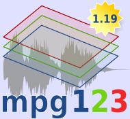

# 1.1 Introdución

Libgdx es un framework de desarrollo y visualización multi-plataforma. Actualmente soporta Windows, Linux, Mac OS X, Android, IOS y como las plataformas que utilizan HTML5.

Libgdx te permite escribir código una vez y desplegarlo en múltiples plataformas sin realizar modificaciones. En lugar de esperar por las últimas modificaciones para ser desplegadas en su dispositivo o compilado a HTML5.
Usted se puede beneficiar de un extremadamente rápido ciclo intereactivo para la codificación de su aplicación principalmente en un entorno de escritorio. Va a poder utilizar todas las herramientas del ecosistema de Java para ser tan productivo como pueda serlo.

Libgdx te permite ir a tan bajo nivel como lo desee, dandole acceso a archivos del sistema, dispositivos de entrada, dispositivo de audio y OpenGL unificando las interfaces 2.0 y 3.0.
Por encima de estas facilidades para el acceso a bajo nivel se contruyó un poderoso conjunto de API's que nos van a ayudar con las tareas comunes para la creación de video juegos como renderizar texto y sprites, crear interfaces de usuario, reproducir música y sonidos de fondo, algebra lineal y calculos trigonométricos, analisis de JSON y XML, y mucho mas.

Cuando es necesario Libgdx deja el reino de Java y recurre a código nativo para obtener el mejor rendimiento posible. Todas estas funcionalidades se ocultan detrás de las API de Java para que no tenga que preocuparse por el cross-compile del código nativo para todas las plataformas.
Muchas partes entorno al trabajo de Libgdx saben lidiar con los problemas conocidos que tienen las diferentes plataformas para que usted no tenga que tratar con ellos.

Libgdx pretender ser un framework en lugar de un motor, ya que se conoce que no existe una única solución para todos. En lugar de eso le damos poderosas abstracciones para que pueda elegir como quiere escribir su juego o aplicación.

## Parados sobre los hombros de gigantes

Libgdx utiliza una gran cantidad de librerías de terceros para poder proporcionar todas sus funcionalidades.

[OpenAL](http://en.wikipedia.org/wiki/OpenAL)

[KissFFT](http://sourceforge.net/projects/kissfft)

## Enlaces

- [Indice](preface.md)
- Siguiente sección: [Objetivos y características](01.1.md)