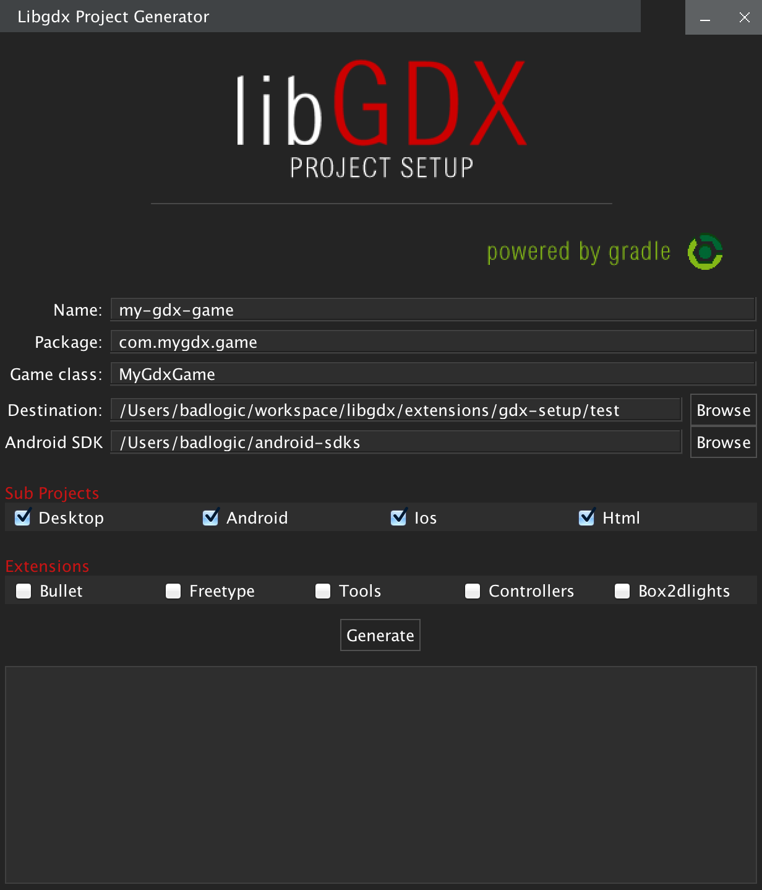

# 2.1 Crear, ejecutar, depurar y empaquetar su proyecto

## Creando un proyecto libgdx

Libgdx viene con un archivo llamado `gdx-setup.jar` que es un ejecutable con UI y una herramienta por linea de comandos. Simplemente podes ejecutar el archivo JAR que abrirá la UI de configuración.

## [Descarga gdx-setup.jar](https://bitly.com/1i3C7i3)

Especifique el nombre de la aplicación, el nombre del paquete Java, el nombre de la clase principal, el directorio de salida y la ruta de acceso al SDK de Android. A continuación, puede seleccionar las plataformas que desea soportar.
Nota: Una vez elegido deberá añadir de forma manual las nuevas plataformas!
Finalmente, puede seleccionar las extensiones que desea incluir en su aplicación. Algunas pueden no funcionar en todas las plataformas, por lo que va a obtener una advertencia. Cuando haya configurado todo, haga clic en "Generate".
Ahora esta listo para poder importar el proyecto en su IDE, correrlo, depurarlo y empaquetarlo.


- [Eclipse](02.2.md)
- [Intellij Idea](02.3.md)
- [NetBeans](02.4.md)
- [Commandline](02.5.md)
  


## Creando el proyecto libgdx desde la línea de comandos

Si lo ejecuta desde la línea de comandos debe especificar los siguientes argumentos:

- **dir**: directorio donde va a escribir el proyecto, dirección relativa o absoluta.
- **name**: nombre de la aplicación en minúsculas, lo más corto posible es una buena idea, por ejemplo: mygame
- **package**: el paquete Java en el que va a vivir nuestro código, por ejemplo: com.badlogic.mygame
- **mainclass**: el nombre de el principal ApplicationListener de su aplicación, por ejemplo: MyGame
- **sdkLocation**: la ubicación del SDK de Android, Intellij utiliza esto si el ANDROID_HOME no esta configurado

Poniendo todo esto junto, puede ejecutar el generador de proyecto desde la línea de comandos de la siguiente forma:

`java -jar gdx-setup.jar --dir mygame --name mygame --package com.badlogic.mygame --mainClass MyGame --sdkLocation mySdkLocation`

## Diseño del proyecto

Esto creara un directorio llamado mygame con la siguiente distribución:

```
settings.gradle            <- definición de sub-modulos. Por defecto core, desktop, android, html, ios
build.gradle               <- archivo principal de configuración de Gradle, definimos dependencias y plugins
gradlew                    <- script que va a correr Gradle en sistemas Unix
gradlew.bat                <- script que va a correr Gradle en Windows
gradle                     <- local gradle wrapper
local.properties           <- archivo único Intellij, definimos la localización del android sdk

core/
    build.gradle           <- Gradle archivo de construcción para el proyecto core, no lo toque!
    src/                   <- Carpeta que contiene el código fuente para todo su juego

desktop/
    build.gradle           <- archivo de construcción para el proyecto desktop, no lo toque!
    src/                   <-Carpeta que contiene el código fuente para su proyecto desktop, contiene la clase lanzadora Lwjgl

android/
    build.gradle           <- Gradle archivo de construcción para el proyecto android, no lo toque, esta vez es enserio!!!
    AndroidManifest.xml    <- configuración específica para Android
    assets/                <- contiene sus imágenes , audio, etc.  Se comparte con otros proyectos.
    res/                   <- contiene iconos para su proyecto u otros recursos
    src/                   <- Carpeta para el código fuente de su proyecto Android, contiene la clase lanzadora de Android

gwt/
    build.gradle           <- Gradle archivo de construcción para el proyecto html, no lo toque!
    src/                   <- Carpeta para el html de su proyecto, contiene la clase lanzadora y las definiciones del html
    webapp/                <- War template, una vez generado contiene una copia del archivo war. Contiene la url de la pagina de inicio y el archivo web.xml


ios/
    build.gradle           <- Gradle archivo de construcción para el proyecto ios, no lo toque a menos que sea masoquista!!!
    src/                   <- Carpeta para el código fuente de su proyecto ios, contiene el lanzador
```

## Que es Gradle?

[Gradle](http://www.gradle.org/) es un sistema para automatizar el manejo de dependencias y un sistema para automatizar la construcción de nuestros proyectos.

El sistema de manejo de dependencias es una forma sencilla para traer las librerías de terceros en nuestros proyectos, sin tener que guardar las librerías en nuestro árbol de directorios del código fuente.
En su lugar, el sistema de manejo de dependencias se basa en un archivo que se encuentra en el árbol de directorios del proyecto donde se encuentra el código fuente donde se específica el nombre y versión de la librería que necesitamos incluir en nuestra aplicación.
Agregar, eliminar y cambiar de versión de una librería de terceros es tan sencillo como cambiar un par de líneas en nuestro archivo de configuración. El sistema de manejo de dependencias va a traer las librerías especificadas de un repositorio central (en nuestro caso [Maven Central](http://search.maven.org/) ) y a guardarlo en un directorio fuera del proyecto.

El sistema de construcción nos va a ayudar a construir y empaquetar nuestra aplicación, sin estar atado a un IDE específico. Esto es especialmente útil si utiliza un servidor de construcción o integración continua, donde los IDE no están disponibles de forma sencilla. En su lugar nuestro servidor de construcción puede llamar al sistema de construcción, dándole una configuración para que sepa como construir el proyecto para diferentes plataformas.

En el caso de Gradle, tanto el sistema de manejo de dependencias como el de construcción van de la mano. Ambos están configurados en el mismo conjunto de archivos. Para mas información vea la sección: [Dependency management with Gradle](https://github.com/libgdx/libgdx/wiki/Dependency-management-with-Gradle)

## Enlaces

- [Indice](preface.md)
- Sección anterior: [Configurar su entorno de desarrollo](02.0.md)
- Siguiente sección: [Eclipse](02.2.md)
