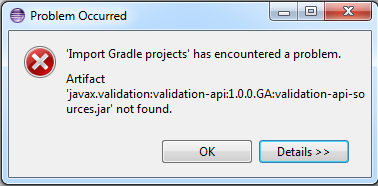

# 2.2 Eclipse

Usted acaba de [generar su proyecto libgdx](02.1.md) , ahora es el momento de empezar a desarrollar en Eclipse! Antes de importar su proyecto en Eclipse, asegúrese de [configurar su entorno de desarrollo](02.0.md)

## Importar su proyecto

Vaya a `File -> Import -> Gradle -> Gradle Project` , haga clic en examinar y navegue a la carpeta raíz de su proyecto, entonces haga clic en `Build Model` . Después de un tiempo, verá un proyecto raíz y subproyectos (android, core, desktop, html, ios).
Seleccione todos los proyectos y haga clic en `finalizar` . Tenga en cuenta que este proceso puede durar uno o dos minutos la primera vez que lo haga, ya que se descargaran Gradle y algunas dependencias en background.

## Problemas comunes

La carpeta para el espacio de trabajo de Eclipse no debería ser la misma que la la raíz del proyecto (mire este [problema](https://github.com/libgdx/libgdx/issues/1537) )
Si se encuentra con el problema missing validation-api:1.0.0.GA artifact, borre la cache de Maven en `C:\Users\username\.m2` o `/Users/username/.m2` o `/home/username/.m2` . 

## Corriendo su proyecto

- **Desktop:** Haga clic derecho en el proyecto desktop, Run As -> Java Application. Selecciones la clase de arranque de desktop (por ejemplo DesktopLauncher.java).
- **Android:** asegúrece de que tiene el dispositivo Android conectado y que se muestra en el DDMS (mire [Android Developer Guide](http://developer.android.com/guide/index.html) ). Haga clic derecho en el proyecto Android, `Run As -> Android Application` .
- **iOS RoboVM:** Haga clic derecho en el proyecto robovm, `Run As -> iOS Device App` para ejecutarlo en un dispositivo conectado, o `Run As -> iOS Simulator App` para correrlo en un simulador de IOS. Si se ejecuta en un dispositivo real, es necesario que donde lo estés ejecutando sea [capaz de desplegar](https://developer.apple.com/library/ios/documentation/ToolsLanguages/Conceptual/YourFirstAppStoreSubmission/ProvisionYourDevicesforDevelopment/ProvisionYourDevicesforDevelopment.html) la aplicación en el.
- **HTML5:** Haga clic derecho en el proyecto html, `Run As -> External Tools Configuration`. Creamos una nueva configuración haciendo doble clic, en la entrada `Program` en la barra lateral izquierda. Dar un nombre a la configuración, por ejemplo GWT SuperDev. Configuramos la ubicación del archivo en el archivo `gradlew.bat` (Windows) o `gradlew` (Linux, Mac). Configuramos la carpeta de trabajo en la raíz del proyecto.
Especificamos `html:superDev` como Argument. Presionamos `Apply`, entonces `Run`. Esperamos hasta que aparezca el mensaje `The code server is ready.` en la vista de la consola, a continuación abrimos la URL [http://localhost:8080/html](localhost:8080/html) . Usted puede dejar corriendo el servidor. Si cambia el código o assets, simplemente hacemos clic en el botón `SuperDev Refresh` en el navegador. Esto va a volver a compilar la aplicación y a re-cargar el sitio. 

Una vez que este [error en la herramienta del API de Gradle](http://issues.gradle.org/browse/GRADLE-1539) fue solucionado, podemos correr directamente el proyecto HTML5 usando la herramienta de integración Gradle. Por el momento se va a ejecutar Gradle siempre, incluso si se cancela.

## Depurando nuestro proyecto

Siga los pasos para ejecutar el proyecto, pero en lugar de correrlo a través de `Run as`, abra la configuración a través de `Debug as`. Tenga en cuenta que RoboVM actualmente no soporta depuración. Debuggin del proyecto html se puede hacer a través de el navegador de la siguiente manera:

Ejecute la configuración superDev como antes. Vaya a [http://localhost:8080/html](http://localhost:8080/html) , haga clic en el botón `SuperDev Refresh`. En Chrome, presione `F12` para abrir las herramientas de desarrollador, vaya a la pestaña de los fuentes y busque el archivo Java que desea depurar. Establezca diferentes puntos de interrupción, vaya paso a paso e inspeccione las variables utilizando el poder de los source maps! Haga clic en el botón `SuperDev Refresh` en caso de que haya cambiado el código o assets (deje el proceso del servidor en corriendo!).

## Empaquetar su proyecto

Es más sencillo empaquetar la aplicación desde la línea de comandos, o mediante las Gradle tasks desde Eclipse. Para ver las Gradle tasks pertinentes, consulte la [documentación de línea de comandos de Gradle](https://github.com/libgdx/libgdx/wiki/Gradle-on-the-Commandline)

## Enlaces

- [Indice](preface.md)
- Sección anterior: [Crear, ejecutar, depurar y empaquetar su proyecto](02.1.md)
- Siguiente sección: [Intellij Idea](02.3.md)
