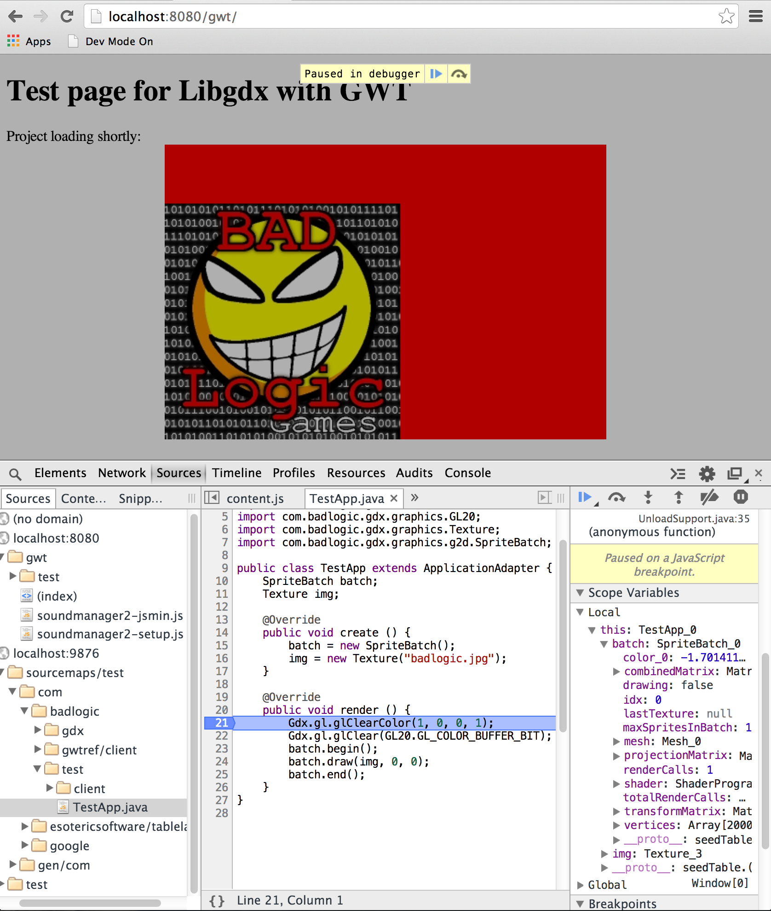

# 2.4 NetBeans

Usted acaba de [generar su proyecto libgdx](https://github.com/libgdx/libgdx/wiki/Project-Setup-Gradle), ahora es el momento de empezar a desarrollar con NetBeans! Antes de importar su proyecto en NetBeans, asegúrese de que tiene [configurado correctamente su entorno de desarrollo!](https://github.com/libgdx/libgdx/wiki/Setting-up-your-Development-Environment-%28Eclipse%2C-Intellij-IDEA%2C-NetBeans%29)

## Importando su proyecto

Vaya a `File -> Open Project...`, navegue a la carpeta raíz de su proyecto, a continuación, haga clic en `Open Project`. NetBeans importará su proyecto. Esto puede tardar un poco la primera vez, a medida que se descarga el envoltorio de Gradle y algunas dependencias. En la ventana del proyecto, expanda el proyecto, a continuación, haga clic derecho en el `subproyecto` y seleccione `Open Subprojects`.

## Problemas comunes

Si corre el proyecto y nos devuelve este problema, missing validation-api:1.0.0.GA artifact, borre la cache de Maven en `C:\Users\username\.m2` o `/Users/username/.m2` o `/home/username/.m2`.

## Corriendo su proyecto

En la ventana del proyecto:

- **Desktop:** Clic derecho en el proyecto desktop, `Run`, simplemente con eso puede correrlo.
- **Android:** Asegurece de tener un dispositivo conectado. Haga clic con el boton derecho en su proyecto Android, `Tasks -> installDebug`
- **iOS RoboVM:** Clic derecho en el proyecto robovm, `Tasks -> launchIPhoneSimulator` (algunas alternativas son `launchIPadSimulator` y [dispositivos aprobicionados](https://developer.apple.com/library/ios/documentation/ToolsLanguages/Conceptual/YourFirstAppStoreSubmission/ProvisionYourDevicesforDevelopment/ProvisionYourDevicesforDevelopment.html) `launchIOSDevicefor`) La primera vez que corra el proyecto llevará un poco de tiempo,  RoboVM tiene que compilar todo el JDK para iOS. La proximas veces que corra el proyecto sera considerablemente más rápido!
- **HTML5:** Haga clic derecho en el proyecto html, `Tasks -> superDev`. Ahora puede seguir el proceso de generación en la consola. Esto tomará un tiempo, por ejemplo el código Java se compila a Javascript. Una vez que vea el mensaje `The code server is ready`, cuando levante el navegador y vaya a [http://localhost:8080/gwt](http://localhost:8080/gwt). Estara tu aplicación ejecutandose en el navegador! Al cambiar cualquiera código Java o assets, simplemente haga clic en el botón `SuperDev Refresh` mientras usted está en el sitio y el servidor volvera a compilar el código y volvera a cargar la página!

## Depurando nuestro proyecto

Siga los pasos para ejecutar el proyecto, pero en lugar de poner correrlo a través de `Run`, inicie la configuración a través de `Debug`. Tenga en cuenta que RoboVM actualmente no admite la depuración. La depuración del html se puede hacer en el navegador de la siguiente manera:

Ejecute la task de Gradle superDev como antes. Vaya a [http://localhost:8080/gwt](http://localhost:8080/gwt), haga clic en el botón `SuperDev Refresh` y pulse `Compile`. En Chrome, pulse `F12` para abrir las herramientas del desarrollador, vaya a la pestaña fuentes y busque el archivo Java que desea depurar. Establezca varios puntos de interrupción, inspeccione paso a paso las variables utilizando el poder de los source maps!

## Empaquetar su proyecto

Es más sencillo empaquetar la aplicación desde la línea de comandos, o mediante las Gradle tasks desde Eclipse. Para ver las Gradle tasks pertinentes, consulte la [documentación de línea de comandos de Gradle](https://github.com/libgdx/libgdx/wiki/Gradle-on-the-Commandline)

- [Indice](preface.md)
- Sección anterior: [Intellij Idea](02.3.md)
- Siguiente sección: [Commandline](02.5.md)
